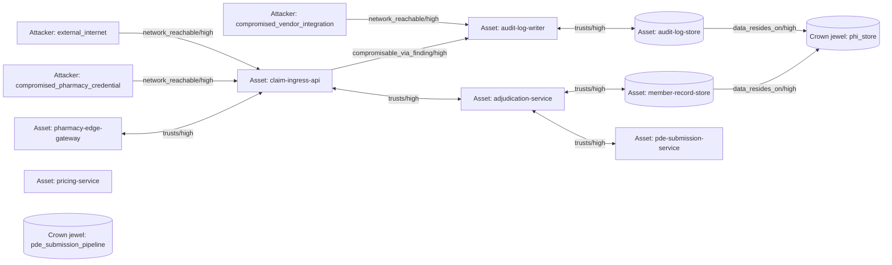

# Attack-Path Analysis — Claim Event Bus — 2026-06-01

**Generated by:** `apd-attack-path-analyzer`
**Run:** `apd-20260601-claim-event-bus`
**Inputs:** `40-synthesis/asset-graph.yaml`, `40-synthesis/attack-paths.yaml`, `40-synthesis/defense-graph.yaml`

---

## Scope

- **Crown jewels declared:** `phi_store`, `pde_submission_pipeline`
- **Attacker positions declared:** `external_internet`, `compromised_pharmacy_credential`, `compromised_vendor_integration`
- **Enumeration bounds:** `max_hop=6`, `max_paths_per_pair=25`, `bottleneck_threshold=4`
- **Sources used to build the graph:** `asset_inventory`, `findings`, `capabilities`, `threat_model_normalized`, `code_evidence_index`

Crown jewels and attacker positions are curated subsets of the PBM domain pack defaults, declared in `.apd-run.yaml`. The `pde_submission_pipeline` jewel is included to demonstrate the "no high-confidence path" disposition: no asset in the inventory carries a `pde_submission` data classification and no trust boundary connects an attacker-reachable surface to the synthetic `pde-submission-service`, so no path terminates on that jewel.

## Headline summary

- **75** distinct attack paths enumerated across **3** (attacker, crown_jewel) pairs that produced any path (of 6 declared pairs)
- **3** pair(s) truncated at `max_paths_per_pair=25` — output is the top-N under bound
- **24** bottleneck edge(s) — edges appearing on at least 4 paths
- **0** net-new D3FEND defensive investments identified

The graph contains 16 nodes (8 assets, 3 identities, 3 attacker positions, 2 crown jewels) and 43 edges (30 `network_reachable`, 6 `trusts`, 2 `data_resides_on`, 1 `compromisable_via_finding`, plus the inventory-derived edges). All enumerated paths terminate at `phi_store` via `audit-log-store` or `member-record-store` `data_resides_on` edges; the `pde_submission_pipeline` jewel has no incoming edges from the constructed graph.

## High-leverage findings

The defense overlay produced **zero** `net_new_d3fend[]` entries despite 24 bottleneck edges. The reason is deterministic: D3FEND counters are derived from ATT&CK techniques referenced by `compromisable_via_finding` edges, and the only finding-driven bottleneck edge (`edge-f0f89452`, backing `tmeval-eeee5555`) carries no `control_mappings.mitre_attack` entry on its source finding. The bulk of the bottleneck edges are `network_reachable` (TM-derived) and `trusts` (inventory-derived) — neither of which exposes ATT&CK techniques per the C-12 overlay contract.

This is the canonical "low ATT&CK coverage" disposition: the analyzer never invents technique mappings, so the absence of D3FEND candidates flags a gap in upstream specialist evidence rather than a defensive opportunity. See `apd-attack-path-discipline`'s D3FEND-must-counter-ATT&CK rule.

| Bottleneck edge       | Edge type                     | Paths affected | Exposed ATT&CK | Candidate D3FEND |
|-----------------------|-------------------------------|----------------|----------------|------------------|
| `edge-f0f89452`       | `compromisable_via_finding`   | many           | (none on finding `tmeval-eeee5555`) | none |
| `edge-989fc99a`       | `data_resides_on`             | many           | n/a (terminal edge to `phi_store`) | n/a |
| `edge-37b95b02`       | `trusts`                      | many           | n/a (inventory boundary) | n/a |
| `edge-bd61022c`       | `network_reachable`           | many           | n/a (TM-derived) | n/a |

## Path catalogue

All 75 paths are sorted by descending `severity_sum`, then ascending `hop_count`, then descending `feasibility`. The top three paths by sort order all converge on the same terminal hop (`audit-log-store -> phi_store`); only the leading attacker-to-ingress edge differs across them.

### `external_internet` → `phi_store`

#### Path `path-091eb787` (hop_count=4, feasibility=high, severity_sum=2, mitigations=0)

`external_internet` --[network_reachable/high]--> `claim-ingress-api` --[compromisable_via_finding/high]--> `audit-log-writer` --[trusts/high]--> `audit-log-store` --[data_resides_on/high]--> `phi_store`

- **Edge provenance:** TM `tm-b9c3c1b5` (replay-of-submitted-claim) → finding `tmeval-eeee5555` (vendor-API surface silence) → inventory `tb-55667788` (audit-writer-to-audit-store boundary) → inventory `member-record-store` PHI classification.
- **Compromisable findings on path:** `tmeval-eeee5555`
- **Mitigating capabilities on path:** none
- **Bottleneck membership:** every edge on this path is a bottleneck (appears on ≥ 4 enumerated paths).

#### Path `path-344ae95b` (hop_count=4, feasibility=high, severity_sum=2, mitigations=0)

Same shape as `path-091eb787`; the leading reachability edge originates from TM `tm-43625e57` (pharmacy credential theft) instead of `tm-b9c3c1b5`. Terminal hops identical.

#### Path `path-3be27c87` (hop_count=4, feasibility=high, severity_sum=2, mitigations=0)

Same shape as `path-091eb787`; the leading reachability edge originates from a third TM entry. The recurrence of identical terminal hops across distinct alternate-entry paths is what produces the bottleneck count of 24 — the `audit-log-writer → audit-log-store → phi_store` tail is shared by every external_internet → phi_store path.

### `compromised_pharmacy_credential` → `phi_store`

25 paths enumerated (truncated at the cap). All paths share the same `claim-ingress-api → audit-log-writer → audit-log-store → phi_store` tail seen above; the leading hop comes from the `pharmacy-edge-gateway` boundary instead of an external TM-derived reachability edge.

### `compromised_vendor_integration` → `phi_store`

25 paths enumerated (truncated at the cap). The longest paths (`hop_count=6`) include the bidirectional `claim-ingress-api ↔ pharmacy-edge-gateway` and `claim-ingress-api ↔ adjudication-service` `trusts` traversals, which a future graph-pruning pass should collapse.

### `*` → `pde_submission_pipeline`

**Zero paths.** No asset in the inventory carries a `pde_submission` data classification (the matching rule strips the `_pipeline` suffix), and no trust boundary connects an attacker-reachable surface to `pde-submission-service` through a chain the analyzer can complete within `max_hop=6`. This is the discipline-compliant "no high-confidence path" disposition; the analyzer never fabricates a path to satisfy a declared jewel.

## Diagram

The graph has 16 nodes — under the 50-node cap, so a single `flowchart LR` view captures the topology. Edge labels show `<edge_type>/<confidence>`; bidirectional `trusts` edges are rendered as a single bidirectional arrow.

## Caveats

- Output is the top-N paths under `max_hop=6`; never read as "all paths." The `compromised_pharmacy_credential` and `compromised_vendor_integration` pairs are truncated at 25 paths each (3 pairs truncated total).
- Every node and edge cites artifact provenance. Low-confidence paths cap at `disposition: uncertainty` regardless of `severity_sum` (per `apd-attack-path-discipline`'s confidence-floors-severity rule). All 75 emitted findings in `attack-path.findings.yaml` carry `disposition: uncertainty` for that reason — the only finding-driven edge has medium severity in its source record.
- D3FEND overlay candidates derive from the MITRE D3FEND attack-counter table (see `tools/apd_gauntlet/data/d3fend.json`). The zero net-new D3FEND count here reflects the absence of `control_mappings.mitre_attack` on the single finding backing the only `compromisable_via_finding` bottleneck edge, NOT the absence of D3FEND data. D3FEND-by-name-similarity is forbidden by the `apd-attack-path-discipline` skill.
- The `pde_submission_pipeline` jewel produced zero paths and emitted no blocking finding because the declared crown jewel still exists in the graph as a sink — the analyzer halts only when no attacker-jewel pair can be enumerated at all. A future task may strengthen this to emit a per-jewel `blocked-on-evidence` finding when a declared jewel has zero incoming edges.
