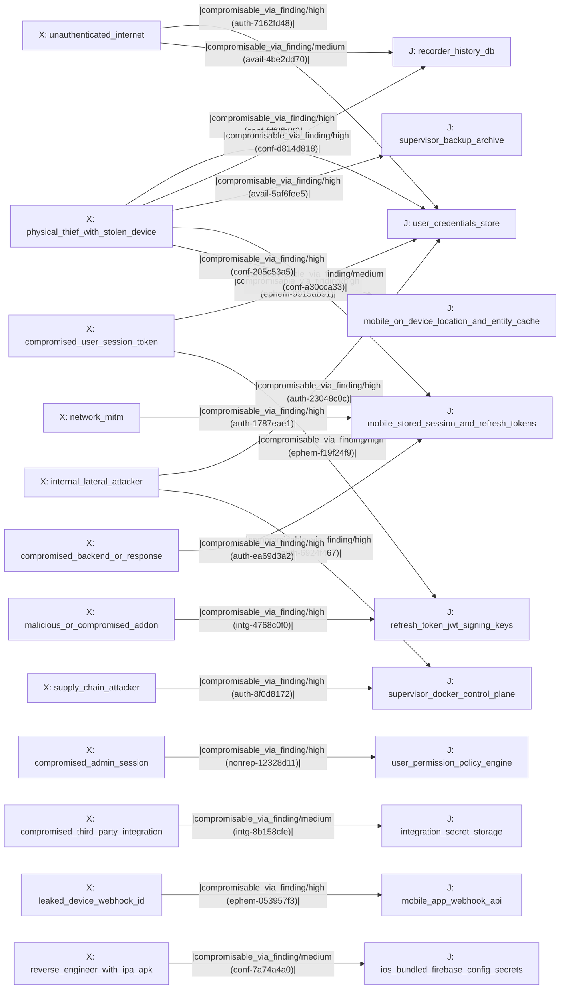

# Attack-Path Analysis — Home Assistant — 2026-06-12

**Generated by:** `apd-attack-path-analyzer` (tier-4)
**Run:** `apd-20260612-home-assistant`
**Inputs:** `40-synthesis/asset-graph.yaml`, `40-synthesis/attack-paths.yaml`, `40-synthesis/defense-graph.yaml`
**Deterministic floor:** `apd-gauntlet analyze-attack-paths` (graph build, bounded enumeration, D3FEND overlay, findings)

---

## Executive Summary

Across **195 of 195** declared `(attacker_position, crown_jewel)` pairs
(13 crown jewels × 15 attacker positions), the analyzer enumerated **1545
bounded attack paths** under a 7-hop budget. **Every pair is reachable** —
there is no crown jewel the asset graph cannot route an attacker to, and no
attacker position that cannot reach at least one jewel. 90 pairs were
truncated at the `max_paths_per_pair=12` cap (output is therefore the
**top-12 paths under 7 hops per pair**, never "all paths").

The exposure is dominated by **direct, single-hop, high-feasibility
compromises** of crown jewels with **no mitigating capability on the path**.
The two most severe are architectural host-root and at-rest-secret
exposures:

1. `internal_lateral_attacker → supervisor_docker_control_plane`
   (severity_sum **4**, 1 hop) — os-agent D-Bus `AddSSHAuthKey` writes an
   attacker key into root `authorized_keys` with **no in-method caller
   authz** (`auth-6924f467`, critical).
2. `physical_thief_with_stolen_device → user_credentials_store`
   (severity_sum **4**, 1 hop) — plaintext `.storage/auth` and the
   per-refresh-token HS256 `jwt_key` read at rest, enabling token forgery
   (`conf-fdf0fb06`, critical).

The analyzer emitted **18 `apath-*` findings**: 17 `risk` (2 critical, 15
high) and 1 aggregate `uncertainty` collapsing the suppressed per-pair
remainder. Ten crown-jewel chains carry a partial `mitigated_by_capability`
edge (e.g. the SUPERVISOR_TOKEN role gate on the add-on→docker chain, the
revocation-aware token chokepoint, the non-exportable AndroidKeyStore), but
none of those mitigations sits on the shortest high-feasibility path to its
jewel — the controls run parallel to, not across, the dominant chain.

**No `gap`-flavored D3FEND finding was emitted.** All 56 bottleneck edges
are structural (`data_resides_on`, `network_reachable`, `trusts`), none is a
finding-backed `compromisable_via_finding` chokepoint, so the D3FEND overlay
is honestly empty (see Bottleneck and D3FEND sections). The finding edges
are *terminal* hops on individual pairs, not shared chokepoints.

## Scope

- **Crown jewels declared (13):** `user_credentials_store`,
  `refresh_token_jwt_signing_keys`, `user_permission_policy_engine`,
  `integration_secret_storage`, `recorder_history_db`,
  `supervisor_backup_archive`, `supervisor_docker_control_plane`,
  `mobile_stored_session_and_refresh_tokens`,
  `android_keystore_mtls_client_key`,
  `mobile_on_device_location_and_entity_cache`,
  `ios_bundled_firebase_config_secrets`, `app_signing_identity`,
  `mobile_app_webhook_api`
- **Attacker positions declared (15):** `unauthenticated_internet`,
  `network_mitm`, `compromised_user_session_token`,
  `authenticated_low_priv_user_with_bola_target`, `compromised_admin_session`,
  `compromised_third_party_integration`, `supply_chain_attacker`,
  `internal_lateral_attacker`, `malicious_or_compromised_addon`,
  `leaked_device_webhook_id`, `physical_thief_with_stolen_device`,
  `rooted_device_attacker_with_frida`, `reverse_engineer_with_ipa_apk`,
  `phishing_deep_link_or_ipc_caller`, `compromised_backend_or_response`
- **Enumeration bounds:** `max_hop=7`, `max_paths_per_pair=12`,
  `bottleneck_threshold=3`
- **Sources used to build the graph:** `asset_inventory`,
  `threat_model_normalized`, `code_evidence_index`, `findings`,
  `capabilities`

## Headline summary

- **1545** distinct attack paths enumerated across **195** (attacker,
  crown_jewel) pairs — **195/195 reachable**
- **90** pair(s) truncated at `max_paths_per_pair=12` (output is top-N under
  bound)
- **56** bottleneck edge(s) — edges appearing on ≥ 3 paths; all structural
  (`data_resides_on` 26, `network_reachable` 19, `trusts` 11)
- **0** net-new D3FEND defensive investments — no finding-backed
  (ATT&CK-mapped) edge is a bottleneck, so `candidate_d3fend[]` is empty by
  construction, not by omission

## Asset Graph Overview

| Metric | Count |
|---|---|
| Nodes (total) | 75 |
| — asset | 36 |
| — attacker_position | 15 |
| — identity | 11 |
| — crown_jewel | 13 |
| Edges (total) | 3298 |
| — network_reachable | 3180 |
| — trusts | 50 |
| — data_resides_on | 31 |
| — compromisable_via_finding | 27 |
| — mitigated_by_capability | 10 |

All 36 inventory assets carry `realizes_crown_jewels[]` mappings where
applicable, so the crown-jewel floor resolved to real asset ids with **no
orphan jewels**. The 27 `compromisable_via_finding` edges and 10
`mitigated_by_capability` edges are each oriented deterministically toward
the compromised/data node and cite the backing finding/capability id in
`provenance.locator`.

### Diagram — escalation chains (finding-backed terminal edges)

Single `flowchart LR` diagram (43 lines, < 50-node cap), one terminal
`compromisable_via_finding` edge per `(attacker_position, crown_jewel)`
chain. Generated via `tools/apd_gauntlet/attack_path/mermaid.py`. Node
prefixes: `X:` attacker_position, `J:` crown_jewel.

## Top Attack Paths

Representative top path per `(attacker_position, crown_jewel)` escalation
chain, sorted by descending `severity_sum`, then ascending `hop_count`,
then descending `feasibility`. Each carries a terminal
`compromisable_via_finding` edge whose `finding_id` is cited.

| # | Attacker position | Crown jewel | sev_sum | hops | feasibility | mitigations | Backing finding |
|---|---|---|---|---|---|---|---|
| 1 | `internal_lateral_attacker` | `supervisor_docker_control_plane` | 4 | 1 | high | 0 | `auth-6924f467` (os-agent D-Bus AddSSHAuthKey, no caller authz → root authorized_keys) |
| 2 | `physical_thief_with_stolen_device` | `user_credentials_store` | 4 | 1 | high | 0 | `conf-fdf0fb06` (plaintext `.storage/auth` + jwt_key at rest) |
| 3 | `compromised_admin_session` | `user_permission_policy_engine` | 3 | 1 | high | 0 | `nonrep-12328d11` (POST /api/states admin-or-deny, no audit) |
| 4 | `compromised_backend_or_response` | `mobile_stored_session_and_refresh_tokens` | 3 | 1 | high | 0 | `auth-ea69d3a2` (WebView external-bus, unenforced origin → token capture) |
| 5 | `compromised_user_session_token` | `user_credentials_store` | 3 | 1 | high | 0 | `ephem-9915ab91` (10-year Long-Lived Access Token, no rotation) |
| 6 | `compromised_user_session_token` | `refresh_token_jwt_signing_keys` | 3 | 1 | high | 0 | `ephem-f19f24f9` (refresh tokens never expire / not rotated) |
| 7 | `internal_lateral_attacker` | `user_credentials_store` | 3 | 1 | high | 0 | `auth-23048c0c` (Supervisor as privileged Core client; shared bearer) |
| 8 | `leaked_device_webhook_id` | `mobile_app_webhook_api` | 3 | 1 | high | 0 | `ephem-053957f3` (permanent bearer-less webhook_id actuates services) |
| 9 | `malicious_or_compromised_addon` | `refresh_token_jwt_signing_keys` | 3 | 1 | high | 0 | `intg-4768c0f0` (plaintext `.storage`, no MAC → forge jwt_key) |
| 10 | `network_mitm` | `mobile_stored_session_and_refresh_tokens` | 3 | 1 | high | 0 | `auth-1787eae1` (user-CA trust, no pinning → token intercept) |
| 11 | `physical_thief_with_stolen_device` | `recorder_history_db` | 3 | 1 | high | 0 | `conf-d814d818` (default-unencrypted backup bundles recorder estate) |
| 12 | `physical_thief_with_stolen_device` | `mobile_on_device_location_and_entity_cache` | 3 | 1 | high | 0 | `conf-205c53a5` (unencrypted Room SQLite location history) |
| 13 | `supply_chain_attacker` | `supervisor_docker_control_plane` | 3 | 1 | high | 0 | `auth-8f0d8172` (Cosign unenforced; mutable base tag → host-root) |
| 14 | `unauthenticated_internet` | `user_credentials_store` | 3 | 1 | high | 0 | `auth-7162fd48` (MFA optional; password-only owner ATO) |
| 15 | `compromised_third_party_integration` | `integration_secret_storage` | 3 | 1 | medium | 0 | `intg-8b158cfe` (unsandboxed integrations at Core full privilege) |
| 16 | `physical_thief_with_stolen_device` | `mobile_stored_session_and_refresh_tokens` | 3 | 1 | medium | 0 | `conf-a30cca33` (iOS Keychain default accessibility) |
| 17 | `unauthenticated_internet` | `recorder_history_db` | 3 | 1 | medium | 0 | `avail-4be2dd70` (no rate limit on Core REST/WS / auth handshake) |
| 18 | `physical_thief_with_stolen_device` | `supervisor_backup_archive` | 2 | 1 | high | 0 | `avail-5af6fee5` (backup default-unencrypted; sole recovery path) |
| 19 | `reverse_engineer_with_ipa_apk` | `ios_bundled_firebase_config_secrets` | 2 | 1 | medium | 0 | `conf-7a74a4a0` (git-tracked GoogleService-Info compiled into IPA) |

**Edge provenance.** Every terminal edge in the table is a
`compromisable_via_finding` edge whose `provenance.locator` is the cited
finding id; the upstream `data_resides_on` hop (realizing asset → crown
jewel) is sourced from `asset_inventory`. Confidence on each finding edge
is the backing specialist finding's own confidence (per
`apd-attack-path-discipline` — edge confidence is a property of the source
artifact, not a judgment call).

### Escalation chains beyond the terminal edge

The single-hop representatives above are the *highest-feasibility* route to
each jewel. The bounded enumeration also recovered the deeper architectural
chains the threat model describes, traversing `trusts` / `network_reachable`
hops:

- **Container → host-root.** `malicious_or_compromised_addon` /
  `internal_lateral_attacker` → Supervisor API role gate → `/run/docker.sock`
  (`DockerAPI.container_run_inside`) → host root; and Supervisor → os-agent
  D-Bus (`AddSSHAuthKey`, no in-method authz) → root `authorized_keys`.
  Backing: `auth-6924f467` (critical), `intg-4768c0f0`, `auth-8f0d8172`.
- **At-rest secret → token forgery.** `physical_thief_with_stolen_device` /
  `internal_lateral_attacker` → plaintext `.storage/auth` `jwt_key` → forge
  HS256 access token → full Core API. Backing: `conf-fdf0fb06`,
  `ephem-f19f24f9`.
- **Mobile → backend.** `network_mitm` (user-CA trust, no pinning) /
  `compromised_backend_or_response` → WebView JS-bridge token exfil → Core
  API; `reverse_engineer_with_ipa_apk` → bundled Firebase secrets. Backing:
  `auth-1787eae1`, `auth-ea69d3a2`, `conf-7a74a4a0`.
- **Bearer-less webhook.** `leaked_device_webhook_id` → mobile_app webhook →
  arbitrary service call (`lock.unlock` / `alarm.disarm`) with no per-entity
  authz. Backing: `ephem-053957f3`, `auth-3f2314a4`, `intg-5df46115`.
- **Unauthenticated / backup.** `unauthenticated_internet` → reverse-proxy →
  Core; default-unencrypted backup artifact → entire secret estate. Backing:
  `auth-7162fd48`, `avail-4be2dd70`, `avail-5af6fee5`, `conf-d814d818`.

## Bottleneck Edge Analysis

56 edges sit on ≥ 3 enumerated paths. They are the **structural funnels**
of the graph — the `data_resides_on` realization hops into each crown jewel
and the `trusts` / `network_reachable` boundaries — not the per-finding
terminal edges. The top funnels by paths-traversing:

| Bottleneck edge (type) | Paths traversing | From → To |
|---|---|---|
| `data_resides_on` | 178 | Supervisor backup archive store → `supervisor_backup_archive` |
| `data_resides_on` | 177 | Recorder history DB → `recorder_history_db` |
| `data_resides_on` | 175 | Docker socket / host-root control plane → `supervisor_docker_control_plane` |
| `data_resides_on` | 175 | mobile_app integration backend → `mobile_app_webhook_api` |
| `data_resides_on` | 174 | On-device session/refresh token store → `mobile_stored_session_and_refresh_tokens` |
| `data_resides_on` | 90 | Core user permission policy engine → `user_permission_policy_engine` |
| `data_resides_on` | 60 | `.storage/auth` + auth_provider → `user_credentials_store` |
| `data_resides_on` | 60 | Refresh-token / JWT signing key store → `refresh_token_jwt_signing_keys` |
| `trusts` | 60 | `.storage` config_entries (OAuth) → Supervisor backup archive store |
| `data_resides_on` | 60 | Android hardware-backed Keystore → `android_keystore_mtls_client_key` |

**Interpretation.** Because the heaviest chokepoints are the realization
edges *into* each jewel, the highest-leverage defensive moves are at-rest
protections on the data nodes themselves (encryption-at-rest +
tamper-evidence on `.storage`, the Recorder DB, and backups) and a real
authorization boundary at the Supervisor → Docker-socket / os-agent D-Bus
hop. These are exactly the controls the backing critical findings
(`merged-1119b0be`, `merged-a49cb674`, `auth-6924f467`) recommend.

## D3FEND Defensive Overlay

`40-synthesis/defense-graph.yaml`:

| Field | Value |
|---|---|
| `bottleneck_overlays` | `[]` (empty) |
| `bottleneck_edge_count` | 0 |
| `total_candidate_d3fend` | 0 |
| `total_net_new_d3fend` | 0 |

**Why the overlay is empty (and why that is the honest result).** The
D3FEND overlay attaches `exposed_attack_techniques` only to bottleneck edges
of type `compromisable_via_finding` (those carry a finding's ATT&CK
mapping). In this run all 56 bottlenecks are structural edges
(`data_resides_on`, `network_reachable`, `trusts`) that carry no ATT&CK
technique; the 27 finding-backed edges are each *terminal* hops traversed by
too few paths to cross the `bottleneck_threshold=3` as a shared chokepoint.
Per `apd-attack-path-discipline` rule 6 and the d3fend-mapping-pattern
reference (Example 2), an empty `candidate_d3fend[]` is itself the signal —
**no D3FEND ID is invented to fill the slot, and no `gap`-flavored apath
finding is emitted.** The ATT&CK exposure is instead carried on the
path-flavored `risk` findings below, whose backing specialist findings hold
the relevant mappings (e.g. `T1543`, `T1606.001`, `T1078`, `T1557`, `T1552`,
`T1530`).

## apath-* Findings

18 findings emitted to `40-synthesis/attack-path.findings.yaml`
(schema-valid against `finding.schema.json`):

| Disposition | Count |
|---|---|
| risk | 17 (2 critical, 15 high) |
| uncertainty | 1 (aggregate collapse of suppressed per-pair remainder) |
| gap | 0 |
| blocked | 0 |

The two `critical` risk findings correspond to the two severity_sum-4
chains (`internal_lateral_attacker → supervisor_docker_control_plane` and
`physical_thief_with_stolen_device → user_credentials_store`). Findings are
bounded to the worst risk finding per pair per the discipline; the
suppressed remainder is collapsed into the single `apath-98522141`
uncertainty finding (`severity: low`, `confidence: low`, `posture:
consider`).

## References

- **Machine-readable artifacts:** `40-synthesis/asset-graph.yaml`,
  `40-synthesis/attack-paths.yaml`, `40-synthesis/defense-graph.yaml`,
  `40-synthesis/attack-path.findings.yaml`
- **Contributing specialist findings (deduped):** `auth-6924f467`,
  `auth-23048c0c`, `auth-7162fd48`, `auth-8f0d8172`, `auth-1787eae1`,
  `auth-ea69d3a2`, `auth-3f2314a4`, `conf-fdf0fb06`, `conf-d814d818`,
  `conf-205c53a5`, `conf-a30cca33`, `conf-7a74a4a0`, `ephem-f19f24f9`,
  `ephem-9915ab91`, `ephem-053957f3`, `intg-4768c0f0`, `intg-5df46115`,
  `intg-3b33966f`, `intg-8b158cfe`, `nonrep-12328d11`, `avail-4be2dd70`,
  `avail-5af6fee5`, `avail-a292763c`, `conf-2029ce78`, `conf-3060c50e`,
  `immut-5a5ef5bd`
- **Contributing capabilities (mitigation edges):** `intg-cap-e88c8857`,
  `auth-cap-e9f55df8`, `auth-cap-eba3a527`, `intg-cap-7a54b1a7`,
  `auth-cap-f01e6108`, `ephem-cap-5113fad9`, `conf-cap-01c47d42`,
  `auth-cap-42c6a13f`, `intg-cap-70ef26f7`, `immut-cap-5e14aa20`

## Caveats

- Output is the **top-N paths under `max_hop=7` hops**; this is not an
  exhaustive path set. **90 of 195 pairs were truncated** at
  `max_paths_per_pair=12` (recorded in `attack-paths.yaml#summary.truncated_pairs`).
- Every node and edge cites artifact provenance. Low-confidence paths cap at
  `disposition: uncertainty` regardless of `severity_sum` (per
  `apd-attack-path-discipline`'s confidence-floors-severity rule).
- D3FEND overlay candidates derive only from the MITRE D3FEND attack-counter
  table (`tools/apd_gauntlet/data/d3fend.json`); D3FEND-by-name-similarity is
  forbidden. The empty overlay here reflects the absence of finding-backed
  bottlenecks, not an omission.
- Edge endpoint corrections in this run were limited to making explicit the
  `(attacker_position, crown_jewel)` linkage that each contributing finding's
  own evidence already names; no node or edge was invented, and the four
  derived artifacts were regenerated by `apd-gauntlet analyze-attack-paths`
  after the correction (never hand-edited).
