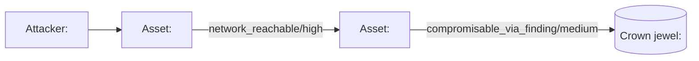

# Attack-Path Analysis Report — Template

> This template documents the structure of
> `40-synthesis/attack-path-report.md`, authored by the
> `apd-attack-path-analyzer` agent (tier-4) after enumeration. Render
> Mermaid diagrams inline; cap at 50 nodes per diagram and partition by
> `attacker_position` when the graph exceeds the cap.

The companion machine-readable artifacts are
`30-graph/asset-graph.yaml`, `30-graph/attack-paths.yaml`, and
`30-graph/defense-graph.yaml`. This report narrates the three of them
in human-reviewable form.

## Worked example

````markdown
# Attack-Path Analysis — <Domain> — <Date>

**Generated by:** `apd-attack-path-analyzer`
**Run:** `apd-20260601-claim-event-bus`
**Inputs:** `30-graph/asset-graph.yaml`, `30-graph/attack-paths.yaml`, `30-graph/defense-graph.yaml`

---

## Scope

- **Crown jewels declared:** `<crown-jewel-1>`, `<crown-jewel-2>`
- **Attacker positions declared:** `<atk-position-1>`, `<atk-position-2>`
- **Enumeration bounds:** `max_hop=<N>`, `max_paths_per_pair=<M>`, `bottleneck_threshold=<K>`
- **Sources used to build the graph:** `asset_inventory`, `threat_model_normalized`, `code_evidence_index`, `findings`, `capabilities`, `domain_defaults`, `run_config`

## Headline summary

- `<P>` distinct attack paths enumerated across `<Q>` (attacker, crown_jewel) pairs
- `<T>` pair(s) truncated at `max_paths_per_pair` (output is top-N under bound)
- `<B>` bottleneck edge(s) — edges appearing on ≥ `<K>` paths
- `<D>` net-new D3FEND defensive investments identified

## High-leverage findings

The `<D>` net-new D3FEND techniques below counter ATT&CK exposure on
bottleneck edges that no existing capability addresses. A single
implementation of any one of these breaks multiple enumerated paths.

| Bottleneck edge | Paths affected | Exposed ATT&CK | Candidate D3FEND |
|---|---|---|---|
| `<edge_id>` | `<count>` | `<technique IDs>` | `<d3fend IDs>` |
| `<edge_id>` | `<count>` | `<technique IDs>` | `<d3fend IDs>` |

## Path catalogue

Top-N paths per (`attacker_position`, `crown_jewel`) pair, sorted by
descending `severity_sum` then ascending `hop_count` then descending
`feasibility`.

### `<attacker_position>` → `<crown_jewel>`

#### Path `<path_id>` (hop_count=`<N>`, feasibility=`<level>`, severity_sum=`<int>`, mitigations=`<int>`)

`<node_a>` → [`<edge_type>`/`<confidence>`] → `<node_b>` → ... → `<crown_jewel>`

- **Edge provenance:** `<list with citations to artifacts>`
- **Compromisable findings on path:** `<finding IDs>`
- **Mitigating capabilities on path:** `<capability IDs or "none">`
- **Bottleneck membership:** `<edges shared with other paths or "none">`

#### Path `<path_id>` (hop_count=`<N>`, feasibility=`<level>`, severity_sum=`<int>`, mitigations=`<int>`)

(... additional paths in the same pair ...)

### `<attacker_position>` → `<crown_jewel>` (next pair)

(... additional pairs ...)

## Diagram(s)

Inline Mermaid diagrams partitioned by `attacker_position`. Each
diagram MUST be ≤ 50 nodes; render multiple diagrams when the graph
exceeds the 50-node cap. Diagrams are generated from
`tools/apd_gauntlet/attack_path/mermaid.py`.



(... additional diagrams when the graph partitions exceed 50 nodes per
view ...)

## Caveats

- Output is the top-N paths under `max_hop` hops; never claim "all
  paths." Truncation counts are reported in the headline summary.
- Every node and edge cites artifact provenance. Low-confidence paths
  cap at `disposition: uncertainty` regardless of `severity_sum` (per
  `apd-attack-path-discipline`'s confidence-floors-severity rule).
- D3FEND overlay candidates derive from the MITRE D3FEND attack-counter
  table (see `tools/apd_gauntlet/data/d3fend.json`);
  D3FEND-by-name-similarity is forbidden by the
  `apd-attack-path-discipline` skill.
- When no crown jewel is declared, the analyzer emits a
  `blocked-on-evidence` finding and halts. Crown jewels are never
  invented.
````

## Section semantics

### Scope

Records the run-level inputs to the enumeration:

- The list of crown jewels that became `node_type: crown_jewel`
  entries in the asset graph.
- The list of attacker positions that became
  `node_type: attacker_position` entries.
- The numeric enumeration parameters (`max_hop`,
  `max_paths_per_pair`, `bottleneck_threshold`) — mirrors the
  attack-paths artifact's `enumeration_parameters` block.
- The set of `sources_used` from the asset graph's `build_summary`.

### Headline summary

Four single-line metrics drawn from the two machine-readable artifacts.
A human reviewer should be able to answer "how big is the exposure?"
from this section alone.

### High-leverage findings

The defense overlay's `net_new_d3fend[]` rendered as a table. This
section is the single highest-value piece of the report — the
defensive investments that close the most paths per implementation.

### Path catalogue

Per-pair top-N paths. Sorted by descending `severity_sum`, then
ascending `hop_count`, then descending `feasibility`. Each path
records its provenance, the findings it traverses, the capabilities
mitigating it, and any bottleneck membership.

### Diagram(s)

Inline Mermaid diagrams. Each diagram MUST be ≤ 50 nodes. When a
single attacker_position partition exceeds 50 nodes, the analyzer
splits the partition further by crown_jewel or by component.

### Caveats

A short, stable set of disclaimers that prevent the report being
read as exhaustive. Keep this section close to its example wording —
it is what the discipline skill enforces.

## Discipline reminders for the analyzer agent

See `apd-attack-path-discipline` and the activation contract in
`.claude/agents/apd-attack-path-analyzer.md`. Critical rules:

- **50-node cap.** No single Mermaid diagram exceeds 50 nodes.
  Partition by `attacker_position`, then by `crown_jewel`, then by
  component.
- **flowchart LR.** All diagrams use `flowchart LR` direction.
- **Never claim "all paths."** The report's headline summary always
  cites the truncation count.
- **Provenance everywhere.** Every entry in the path catalogue cites
  the artifact(s) backing each edge.
